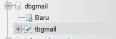

# 1. Mampu menunjukkan keseluruhan Use Case beserta ranking dari tiap Use Case dari produk digital.

> Use Case 

Status | Nama Use Case | Nilai Prioritas
--- | --- | --- 
public | Registrasi | 100
user | Login/Logout| 90
user | Mengirim Email| 80
user | Membuka Email| 80
user | Membalas Email| 80
user | Menghapus Email | 80
user | Meneruskan Email| 70
user | Mencari Email| 70
user | Mengarsipkan Email | 50
user | Draft Email | 50
user | Memindahkan Email ke suatu folder| 40
user | Menandai spam Email| 40
Manajemen | Lihat Daftar Email Masuk | 70
Manajemen | Pengaturan Email| 20
manajemen | Switch Akun | 20
manajemen | Lihat Daftar Akun | 20
manajemen | Beri Notifikasi | 10 
direksi | Dasboard Analisis | 30

Pada Use Case Di atas Terdapat : 

- Keterangan Status
        
    - Public : Menunjukkan bahwa fitur yang terkait dapat diakses oleh publik secara umum. Seperti pada use case "Registrasi" memiliki status "public", yang berarti proses registrasi terbuka bagi siapa pun yang ingin membuat akun baru.
    - User : Menunjukkan bahwa fitur tersebut ditujukan untuk pengguna yang telah terdaftar dan masuk ke dalam sistem. Seperti pada Use case "Login/Logout". Hanya pengguna yang telah memiliki akun dan masuk ke dalam sistem yang dapat menggunakan kumpulan use case tersebut.

    - Manajemen : Ditujukkan untuk pengguna dengan peran manajemen atau administrator dalam sistem. Seperti pada Use case "Lihat Daftar Email Masuk". Dimana Fitur  ini memberikan akses dan kontrol kepada pengguna dengan peran manajemen untuk melihat dan mengelola informasi yang berkaitan dengan pengguna atau fungsi sistem.

     - Direksi : Menunjukkan bahwa use case ini berkaitan dengan analisis data dan informasi yang relevan untuk menginformasikan keputusan strategis yang dibutuhkan oleh suatu direksi. Hal Ini membantu dalam mengidentifikasi peluang, mengatasi tantangan.


- Keterangan Nilai prioritas

    - Menggambarkan tingkat kepentingan dari masing-masing use case. Di mana semakin tinggi nilai prioritasnya, semakin tinggi tingkat kepentingan use case tersebut.


# 2. Mampu mendemonstrasikan Class Diagram dari keseluruhan Use Case produk digital.

> Class Diagram


- Keterangan 
    - Class Diagram Menggunakan Mermaid.js
    - Setiap kelas miliki hubungan antar kelas, seperti kelas "MainGmail", "User","MainMenu","PencarianEmail","abstract Email","Dasboard" memiliki hubungan asosiasi yaitu sebagai hubungan antara dua class yang bersifat statis.
    - Pada kelas "Kotak_Masuk", "Terkirim", "Buat", "Draf", "abstrack Email", dll. memiliiki hubungan pewarisan yaitu kemampuan untuk mewarisi seluruh atribut dan metode dari kelas induk (superclass) ke anak kelas (subclass).
    - Pada Setiap Kelas bisa terdapat atribut maupun method. Untuk method memiliki ciri dengan menggunakan "()".
    - Simbol "+" = Public, Simbol "-" = Private, Simbol "#" = Protected


# 3. Mampu menunjukkan dan menjelaskan penerapan setiap poin dari SOLID Design Principle.

```
// Implementasi dari UserOperations (operasi dasar pengguna)
class User implements UserOperations {
    private String username, password;

    @Override
    public void registrasiAkun() {
        Scanner input = new Scanner(System.in);

        System.out.println("== DAFTAR AKUN ==");
        System.out.print("Username: ");
        username = input.nextLine();
        System.out.print("Password: ");
        password = input.nextLine();

        System.out.println("Akun Anda berhasil didaftarkan.");
    }

    @Override
    public boolean loginAkun() {
        Scanner input = new Scanner(System.in);

        System.out.println("== LOGIN  ==");
        System.out.print("Username: ");
        String inputUsername = input.nextLine();
        System.out.print("Password: ");
        String inputPassword = input.nextLine();

        if (inputUsername.equals(username) && inputPassword.equals(password)) {
            System.out.println("Login berhasil.");
            return true;
        } else {
            System.out.println("Username atau password salah.");
            return false;
        }
    }

    @Override
    public void logoutAkun() {
        System.out.println("Anda berhasil logout.");
    }

    @Override
    public String getUsername() {
        return username;
    }
}

// Implementasi dari EmailOperations
abstract class Email implements EmailOperations {
    protected List<String> emails;

    public Email() {
        emails = new ArrayList<>();
    }

    public String getEmail(int index) {
        if (index >= 0 && index < emails.size()) {
            return emails.get(index);
        } else {
            return null;
        }
    }

    @Override
    public void tambahEmail(String email) {
        emails.add(email);
    }

    @Override
    public int hitungJumlahEmail() {
        return emails.size();
    }

    @Override
    public List<String> getEmails() {
        return emails;
    }

    @Override
    public void hapusEmail(int index) {
        if (index >= 0 && index < emails.size()) {
            emails.remove(index);
        } else {
            System.out.println("Indeks email tidak valid.");
        }
    }
}

// Kelas turunan dari Email
class KotakMasuk extends Email {
    @Override
    public void tampilkan() {
        System.out.println("== Kotak Masuk ==");
        if (emails.isEmpty()) {
            System.out.println("Tidak ada email dalam kotak masuk.");
        } else {
            for (String email : emails) {
                System.out.println(email);
            }
        }
    }

    @Override
    public void kirimEmail(int index) {
    }
}

class MainMenu {
    public static void tampilkan(UserOperations user) {
        int pilihanMenu;
        Scanner input = new Scanner(System.in);

        KotakMasuk kotakMasuk = new KotakMasuk();
        Terkirim terkirim = new Terkirim();
        Draf draf = new Draf();
        Buat buat = new Buat();
        List<EmailOperations> daftarEmail = new ArrayList<>();
        daftarEmail.add(kotakMasuk);
        daftarEmail.add(terkirim);
        daftarEmail.add(draf);

        do {
            System.out.println("\nSelamat Datang di Gmail, " + user.getUsername());
            System.out.println("----------------------\n");
            System.out.println("== Silahkan Memilih Menu ==");
            System.out.println("1. Kotak Masuk");
            System.out.println("2. Terkirim");
            System.out.println("3. Draf");
            System.out.println("4. Buat Email Baru");
            System.out.println("5. Cari Email");
            System.out.println("6. Hapus Email");
            System.out.println("7. Logout");
            System.out.println();
            System.out.print("Pilihan: ");
            pilihanMenu = input.nextInt();

            switch (pilihanMenu) {
                case 1:
                    kotakMasuk.tampilkan();
                    kotakMasuk.hitungJumlahEmail();
                    break;
                case 2:
                    terkirim.tampilkan();
                    terkirim.hitungJumlahEmail();
                    break;
                case 3:
                    draf.tampilkan();
                    draf.hitungJumlahEmail();
                    int nomorEmailDraf = draf.hitungJumlahEmail();
                    if (nomorEmailDraf > 0) {
                        System.out.print("Masukkan nomor email yang ingin dikirim: ");
                        int nomorEmail = input.nextInt();
                        if (nomorEmail >= 1 && nomorEmail <= nomorEmailDraf) {
                            EmailOperations email = draf;
                            email.kirimEmail(nomorEmail - 1);
                            terkirim.tambahEmail(draf.getEmail(nomorEmail - 1));
                            terkirim.tambahStatusPengiriman("Sudah Terkirim");
                            draf.hapusEmail(nomorEmail - 1);
                        } else {
                            System.out.println("Nomor email tidak valid.");
                        }
                    } else {
                        System.out.println("Tidak ada email dalam draf.");
                    }
                    break;
                case 4:
                    buat.tampilkan();
                    System.out.print("Apakah Anda ingin mengirim email ini? (y/n): ");
                    String konfirmasi = input.next();
                    if (konfirmasi.equalsIgnoreCase("y")) {
                        kotakMasuk.tambahEmail(((Buat) buat).getEmail());
                        ((Buat) buat).kirimEmail(buat.hitungJumlahEmail() - 1);
                        terkirim.tambahEmail(buat.getEmail());
                        terkirim.tambahStatusPengiriman("Sudah Terkirim");
                    } else {
                        draf.tambahEmail(((Buat) buat).getEmail());
                        System.out.println("Email berhasil disimpan di Draf.");
                    }
                    break;
                case 5:
                    input.nextLine();
                    System.out.print("Masukkan kata kunci: ");
                    String keyword = input.nextLine();
                    PencarianEmail.cariEmail(daftarEmail, keyword);
                    break;
                case 6:
                hapusEmail(daftarEmail);
                    break;
                case 7:
                    user.logoutAkun();
                    pilihanMenu = 0; // Set pilihanMenu ke 0 agar keluar dari perulangan utama
                    break;
                default:
                    System.out.println("Pilihan tidak valid.");
                    break;
            }
        } while (pilihanMenu != 0);
    }

```

Single Responsibility Principle (SRP):

- Setiap kelas atau modul dalam program harus memiliki tanggung jawab tunggal yang terkait dengan fungsionalitas yang spesifik. Jika terdapat perubahan pada satu tanggung jawab, tidak harus mempengaruhi tanggung jawab lainnya.

- Masing-masing kelas pada kelas User, Email, KotakMasuk, Terkirim, Draf, Buat, PencarianEmail, MainMenu memiliki tanggung jawab yang jelas dan terfokus pada fungsionalitas yang spesifik.


Open/Closed Principle (OCP):

- Entitas perangkat lunak (kelas, modul, dll.) harus terbuka untuk perluasan (open) tetapi tertutup untuk modifikasi (closed).Prinsip ini mendorong penggunaan pewarisan dan polimorfisme untuk memperluas fungsionalitas, daripada mengubah kode yang sudah ada.

- Pada Program di atas terdapat pada kelas Email sebagai induk Kelas yang mendorong pewarisan dan  polimorfisme terhadap kelas turunan yaitu kelas KotakMasuk, Terkirim, Draf, Buat, PencarianEmail.

Liskov Substitution Principle (LSP):

- Subclass atau anak kelas dapat menggantikan kelas dasarnya tanpa mengubah atribut dan perilaku yang diharapkan dari kelas dasar.

- Program di atas menggunakan pewarisan kelas Email untuk mengimplementasikan kelas turunan pada kelas KotakMasuk, Terkirim, Draf, dan Buat. 

Interface Segregation Principle (ISP):

- Sebuah objek client tidak boleh dipaksa untuk mengimplementasikan sebuah interface yang tidak ia gunakan. Atau Sebuah interface tidak boleh menyediakan semua service untuk client objek. Satu interface hanya memiliki satu tugas spesifik untuk tiap clientnya.

- Program di atas mengimplementasikan beberapa antarmuka, seperti UserOperations dan EmailOperations, yang membagi tanggung jawab dan operasi menjadi unit yang lebih kecil dan terpisah. Client dapat mengimplementasikan antarmuka yang dibutuhkan tanpa harus bergantung pada metode yang tidak digunakan.

Dependency Inversion Principle (DIP):

- Kode harus bergantung pada abstraksi, bukan pada implementasi. Modul tingkat tinggi tidak boleh bergantung pada modul tingkat rendah. Keduanya harus bergantung pada abstraksi.

- Seperti pada Kelas MainMenu bergantung pada interface UserOperations dan EmailOperations sebagai dependensinya. Ini memungkinkan penggunaan objek-objek yang mengimplementasikan interface tersebut secara fleksibel. 


# 4. Mampu menunjukkan dan menjelaskan Design Pattern yang dipilih.

```
// Interface untuk operasi dasar pengguna
interface UserOperations {
    void registrasiAkun();
    boolean loginAkun();
    void logoutAkun();
    String getUsername();
}

// Interface untuk operasi dasar email
interface EmailOperations {
    void tampilkan();
    int hitungJumlahEmail();
    List<String> getEmails();
    void tambahEmail(String email);
    void hapusEmail(int index);
}

// Implementasi dari UserOperations (operasi dasar pengguna)
class User implements UserOperations {
    private String username, password;

    @Override
    public void registrasiAkun() {
        Scanner input = new Scanner(System.in);

        System.out.println("== DAFTAR AKUN ==");
        System.out.print("Username: ");
        username = input.nextLine();
        System.out.print("Password: ");
        password = input.nextLine();

        System.out.println("Akun Anda berhasil didaftarkan.");
    }

    @Override
    public boolean loginAkun() {
        Scanner input = new Scanner(System.in);

        System.out.println("== LOGIN  ==");
        System.out.print("Username: ");
        String inputUsername = input.nextLine();
        System.out.print("Password: ");
        String inputPassword = input.nextLine();

        if (inputUsername.equals(username) && inputPassword.equals(password)) {
            System.out.println("Login berhasil.");
            return true;
        } else {
            System.out.println("Username atau password salah.");
            return false;
        }
    }

    @Override
    public void logoutAkun() {
        System.out.println("Anda berhasil logout.");
    }

    @Override
    public String getUsername() {
        return username;
    }
}
```

Factory Pattern :

- Digunakan dalam program di atas untuk mendefinisikan beberapa interface Seperti UserOperations dan EmailOperations) yang merepresentasikan operasi dasar untuk pengguna dan email pada kelas-kelas konkrit seperti kelas User, KotakMasuk, Terkirim, Draf, dan Buat,kemudian mengimplementasikan interface-interface tersebut.

- Factory Pattern bertanggung jawab untuk membuat objek-objek yang terkait dengan operasi pengguna dan email. Misalnya, terdapat interface UserOperations yang didefinisikan dengan beberapa operasi seperti registrasiAkun, loginAkun, logoutAkun, dan getUsername. Kemudian, ada kelas User yang mengimplementasikan interface ini dan menyediakan implementasi konkret untuk setiap operasi tersebut.

- Dengan menggunakan pola desain Factory Pattern,  kita dapat menggunakan objek-objek dari kelas-kelas yang mengimplementasikan interface EmailOperations untuk mengakses operasi-operasi email tanpa perlu tahu secara spesifik tentang kelas yang diimplementasikan.


```
// Kelas turunan dari Email
class Buat extends Email {
    private String email;
    private String pengirim;
    private String tujuan;
    private String subjek;
    private String isi;

    public String getEmail() {
        return email;
    }

    @Override
    public void tampilkan() {
        System.out.println("== Buat Email Baru ==");
        Scanner input = new Scanner(System.in);
        System.out.print("Pengirim: ");
        pengirim = input.nextLine();
        System.out.print("Tujuan: ");
        tujuan = input.nextLine();
        System.out.print("Subjek: ");
        subjek = input.nextLine();
        System.out.print("Isi: ");
        isi = input.nextLine();

        email = "Pengirim: " + pengirim + "\n" +
                "Subjek: " + subjek + "\n" +
                "Isi: " + isi + "\n";

        tambahEmail(email);
        System.out.println("Email berhasil dibuat dan terkirim ke " + tujuan);
    }
}
```

Builder Pattern :

- Digunakan dalam kelas Buat yang berperan sebagai builder untuk membangun objek email dengan atribut-atribut seperti pengirim, tujuan, subjek, dan isi.

- Terdapat metode tampilkan() dalam kelas Buat yang memungkinkan pengguna memasukkan informasi email seperti pengirim, tujuan, subjek, dan isi. Setelah informasi email dimasukkan, metode ini akan membangun email dan menyimpannya dalam atribut email.

```
// Interface untuk operasi dasar email
interface EmailOperations {
    void tampilkan();
    int hitungJumlahEmail();
    List<String> getEmails();
    void tambahEmail(String email);
    void hapusEmail(int index);
}

// Implementasi dari UserOperations (operasi dasar pengguna)
class User implements UserOperations {
    private String username, password;

    @Override
    public void registrasiAkun() {
        Scanner input = new Scanner(System.in);

        System.out.println("== DAFTAR AKUN ==");
        System.out.print("Username: ");
        username = input.nextLine();
        System.out.print("Password: ");
        password = input.nextLine();

        System.out.println("Akun Anda berhasil didaftarkan.");
    }

    @Override
    public boolean loginAkun() {
        Scanner input = new Scanner(System.in);

        System.out.println("== LOGIN  ==");
        System.out.print("Username: ");
        String inputUsername = input.nextLine();
        System.out.print("Password: ");
        String inputPassword = input.nextLine();

        if (inputUsername.equals(username) && inputPassword.equals(password)) {
            System.out.println("Login berhasil.");
            return true;
        } else {
            System.out.println("Username atau password salah.");
            return false;
        }
    }

    @Override
    public void logoutAkun() {
        System.out.println("Anda berhasil logout.");
    }

    @Override
    public String getUsername() {
        return username;
    }
}

// Implementasi dari EmailOperations
abstract class Email implements EmailOperations {
    protected List<String> emails;

    public Email() {
        emails = new ArrayList<>();
    }

    @Override
    public void tambahEmail(String email) {
        emails.add(email);
    }

    @Override
    public int hitungJumlahEmail() {
        return emails.size();
    }

    @Override
    public List<String> getEmails() {
        return emails;
    }

    @Override
    public void hapusEmail(int index) {
        emails.remove(index);
    }
}

// Kelas turunan dari Email
class KotakMasuk extends Email {
    @Override
    public void tampilkan() {
        System.out.println("== Kotak Masuk ==");
        if (emails.isEmpty()) {
            System.out.println("Tidak ada email dalam kotak masuk.");
        } else {
            for (String email : emails) {
                System.out.println(email);
            }
        }
    }
}

// Kelas turunan dari Email
class Terkirim extends Email {
    private List<String> statusPengiriman;

    public Terkirim() {
        statusPengiriman = new ArrayList<>();
    }

    public void tambahStatusPengiriman(String status) {
        statusPengiriman.add(status);
    }

    @Override
    public void tampilkan() {
        System.out.println("== Kotak Terkirim ==");
        if (emails.isEmpty()) {
            System.out.println("Tidak ada email terkirim.");
        } else {
            for (int i = 0; i < emails.size(); i++) {
                System.out.println(emails.get(i));
                System.out.println("Status Pengiriman: " + statusPengiriman.get(i));
                System.out.println();
            }
        }
    }
}

// Kelas turunan dari Email
class Draf extends Email {
    @Override
    public void tampilkan() {
        System.out.println("== Draf ==");
        if (emails.isEmpty()) {
            System.out.println("Tidak ada email dalam draf.");
        } else {
            for (String email : emails) {
                System.out.println(email);
            }
        }
    }
}

// Kelas turunan dari Email
class Buat extends Email {
    private String email;
    private String pengirim;
    private String tujuan;
    private String subjek;
    private String isi;

    public String getEmail() {
        return email;
    }

    @Override
    public void tampilkan() {
        System.out.println("== Buat Email Baru ==");
        Scanner input = new Scanner(System.in);
        System.out.print("Pengirim: ");
        pengirim = input.nextLine();
        System.out.print("Tujuan: ");
        tujuan = input.nextLine();
        System.out.print("Subjek: ");
        subjek = input.nextLine();
        System.out.print("Isi: ");
        isi = input.nextLine();

        email = "Pengirim: " + pengirim + "\n" +
                "Subjek: " + subjek + "\n" +
                "Isi: " + isi + "\n";

        tambahEmail(email);
        System.out.println("Email berhasil dibuat dan terkirim ke " + tujuan);
    }
}
```

Template Method Pattern :

- Pola desain ini memungkinkan kelas-kelas yang mengimplementasikan EmailOperations untuk memiliki perilaku yang berbeda dalam menampilkan email, tetapi masih mengikuti kerangka umum yang telah ditetapkan dalam metode induk. Seperti pada metode tampilkan() dalam kelas-kelas yang mengimplementasikan interface EmailOperations.

- Pola ini memisahkan struktur umum atau kerangka kerja dari implementasi yang spesifik. Dalam konteks program ini, struktur umum operasi tampilkan email didefinisikan dalam metode tampilkan() dalam kelas-kelas seperti KotakMasuk, Terkirim, Draf, dan Buat. Namun, setiap kelas turunan memiliki implementasi yang berbeda-beda untuk langkah-langkah spesifik dalam menampilkan email.

- Misalnya, dalam kelas KotakMasuk, metode tampilkan() mencetak email-email yang ada dalam kotak masuk. Di sisi lain, dalam kelas Terkirim, metode tampilkan() mencetak email-email yang ada dalam kotak terkirim beserta status pengirimannya. 


# 5. Mampu menunjukkan dan menjelaskan konektivitas ke database.

> Membuat Database  





- Memasuki  http://localhost/phpmyadmin dengan menggunakan aplikasi XAMPP.
- Membuat Database baru dengan nama dbgmail dan membuat tabel dengan nama tbgmail.
- Mengisi tabel dengan kolom name, username, password.


>  Konfigurasi Koneksi Dari Java Ke Database


```
import java.sql.Connection;
import java.sql.DriverManager;
import java.sql.SQLException;

public class konek {

    public static Connection getConnection() {
        Connection conn = null;
        String url = "jdbc:mysql://localhost:3306/dbgmail";
        String user = "root";
        String password = "";
        try {
            conn = DriverManager.getConnection(url, user, password);
        } catch (SQLException e) {
            System.out.println(e);
        }
        return conn;
    }

    public static void main(String[] args) {
        try {
            Connection c = konek.getConnection();
            System.out.println(String.format("Connected to database %s " + "successfully.", c.getCatalog()));
        } catch (SQLException e) {
            System.out.println(e);
        }
    }
}
```

- Menggunakan mysql connector sebagai library konektivitas ke database.
- Membuat kelas konek yang berfungsi untuk menghubungkan aplikasi ke database. Jika berhasil maka akan keluar output "Berhasil Connect ke Database yang dituju".


> Memanggil Kelas konek ke Kelas Program Utama


```
private void jButton_RegisterActionPerformed(java.awt.event.ActionEvent evt) {                                                 
       try {
        
        if (jTextField1.getText().equals("") || jTextField2.getText().equals("") || jPasswordField3.getPassword().equals("") || jPasswordField2.getPassword().equals("")) {
            JOptionPane.showMessageDialog(rootPane, "Data Tidak Boleh Kosong", "Pesan", JOptionPane.ERROR_MESSAGE);  
                 jTextField1.requestFocus();
                hapuslayar();
        }
        else if (jPasswordField3.getText().equals(jPasswordField2.getText())) {
           name = jTextField1.getText();
            username = jTextField2.getText();
            password = jPasswordField3.getText();
            
            Connection conn = konek.getConnection();
            st=conn.createStatement();
            String simpan = "INSERT INTO tbgmail values('"+jTextField1.getText()+"','"+jTextField2.getText()+"','"+String.valueOf(jPasswordField3.getPassword())+"')";
            st=conn.createStatement();
            int SA = st.executeUpdate(simpan);
            JOptionPane.showMessageDialog(this, "Registrasi Berhasil");
            this.setVisible(false);
            
            Login lg = new Login();
            lg.setVisible(true);
            lg.pack();
            lg.setLocationRelativeTo(null);
            lg.setDefaultCloseOperation(Register.EXIT_ON_CLOSE);
        }         
        else{
            jLabel7.setText("Password Tidak COCOk");
        }
                
                
        } catch (Exception e) {
        JOptionPane.showMessageDialog(this,"Akun Ini Sudah Ada (Duplikat Akun)", "Pesan", JOptionPane.WARNING_MESSAGE);
        hapuslayar();
           
       }
        
    }     

```

- Memanggil fungsi Konfigurasi yang telah dibuat ke dalam fungsi di dalam program aplikasi yang data nya akan di Konfigurasi ke dalam database.
- Seperti pada program di atas terdapat fungsi untuk registrasi di dalam aplikasi. Di dalam fungsi tersebut memanggil kelas Konfigurasi dan menambahkan suatu perintah agar data yang di inputkan pengguna seperti : nama, username, dan password dapat tersimpan di database pada tabel tbgmail.


Setelah berhasil melakukan konektivitas dari aplikasi java ke database, maka data pengguna akan tersimpan di database. Sehingga ketika pengguna sudah melakukan registrasi akun pada aplikasi. Lalu pengguna membuka kembali aplikasi, pengguna bisa tinggal langsung login tanpa harus registrasi akun kembali. 

# 6. Mampu menunjukkan dan menjelaskan pembuatan web service dan setiap operasi CRUD nya.

Pembuatan Restful Api dengan menggunakan PHP dan Melakukan Pengetesan Restful Api dengan Aplikasi Postman.

>  Membuat File Koneksi untuk Menghubungkan ke  Database yang Telah Dibuat.


```
<?php
        define('HOST', 'localhost'); 
        define('USER', 'root'); 
        define('DB', 'dbgmail');
        define('PASS','');
        $conn = new mysqli(HOST, USER, PASS, DB) or die('Koneksi error untuk mengakses database');

        header('Content-Type: application/json');
?>
```

- Program di atas adalah bagian program dari File koneksi_db.php yang akan digunakan agar bisa terhubung ke database dbgmail.
- Di dalam program tersebut terdapat struktur serta fungsi untuk mengkonfigurasi ke database, serta terdapat perintah header yang berfungsi untuk menghasilkan output json.

> Membuat File Setiap Operasi CRUD

##### 1.  Create

```
<?php     
      require_once('koneksi_db.php');
        if (isset($_POST['name']) && isset($_POST['username']) && isset($_POST['password'])) {
        $name = $_POST['name'];
        $username = $_POST['username'];
        $password = $_POST['password'];
        $sql = $conn->prepare("INSERT INTO tbgmail (name, username, password) VALUES (?,?,?)");
        $sql->bind_param('sss', $name, $username, $password);
        $sql->execute();
         if ($sql) {
        
        echo json_encode(array('RESPONSE' => 'SUCCESS'));
        
        } else {
        echo "GAGAL";
        }
    }
?>
```

- Program di atas meruoakan bagian program dari file api_tambah.php yang berfungsi untuk menambah data baru.
- require_once berguna untuk memanggil fungsi pada file koneksi_db.php 
- Di operasi ini kita bisa melakukan fungsi post untuk menambah data baru yang nantinya akan tersimpan ke database.

  

- Disini saya melakukan pengujian pada aplikasi post man dengan send request Post menambahkan data baru yaitu dengan nama, username, dan password. Respon yang dihasilkan yaitu mendapatkan respon "sukses" dengan output json.

    

 - Data berhasil tersimpan di database.


##### 2.  Read

```
<?php

        require_once('koneksi_db.php');
        $myArray = array();
        if ($result = mysqli_query($conn, "SELECT * FROM tbgmail ORDER BY username ASC")){
            while ($row = $result->fetch_array(MYSQLI_ASSOC)){
            $myArray[] = $row;
        }
        mysqli_close($conn); 
        echo json_encode($myArray);
    }
    
?>

```

- Program di atas merupakan bagian program dari file api_tampil.php yang berfungsi untuk melihat seluruh data.
- require_once berguna untuk memanggil fungsi pada file koneksi_db.php
- Di operasi ini kita bisa melakukan fungsi get untuk melihat seluruh data yang tersimpan ke database.

  

- Disini saya melakukan pengujian pada aplikasi post man dengan send request Get dan Respon yang dihasilkan yaitu menampilkan data keseluruhan dengan output json.


##### 3.  Update

```
<?php  
        require_once('koneksi_db.php');
        $data = json_decode (file_get_contents("php://input"));

        if ($data->name!=null){
        $name          = $data->name;
        $username      = $data->username;
        $password      = $data->password;
    
        $sql = $conn->prepare("UPDATE tbgmail SET username=?, password=? WHERE name=?"); 
        
        $sql->bind_param('sss', $username, $password, $name);
         $sql->execute();
        if ($sql){
            echo json_encode(array('RESPONSE' => 'SUCCESS'));
        }else{
            echo json_encode(array('RESPONSE' => 'FAILED'));
        }
        }else{
            echo "GAGAL";
        }
?>

```

- Program di atas merupakan bagian program dari file api_edit.php yang berfungsi untuk mengubah  data, yang dicari berdasarkan nama.
- require_once berguna untuk memanggil fungsi pada file koneksi_db.php
- Di operasi ini kita bisa melakukan fungsi put untuk mengubah data.

  

- Disini saya melakukan pengujian pada aplikasi post man dengan send request Put, yaitu pada data dengan nama Acun terdapat perubahan pada bagian username dan password nya. Respon yang dihasilkan yaitu mendapatkan respon "sukses" dengan output json.

  

 - Setelah melakukan perubahan data,untuk melihat perubahan data bisa dengan send request Get dan nanti akan keluar perubahan datanya dengan output json.


 ##### 4.  Delete

```
<?php  
        require_once('koneksi_db.php');
        $data = json_decode(file_get_contents("php://input"));

        if ($data->name!=null){
             $name=$data->name;
                $sql = $conn->prepare("DELETE FROM tbgmail WHERE name=?");
                $sql->bind_param('s', $name);
                $sql-> execute();
                
                if ($sql){
                    echo json_encode(array('RESPONSE' => 'SUCCESS'));
                }else {
                    echo json_encode(array('RESPONSE' => 'FAILED'));
                 }
        }else{ 
            echo "gagal";
        }
?>

```

- Program di atas merupakan bagian program dari file api_hapus.php yang berfungsi untuk menghapus data berdasarkan nama.
- require_once berguna untuk memanggil fungsi pada file koneksi_db.php
- Di operasi ini kita bisa melakukan fungsi delete untuk menghapus data.

  

- Disini saya melakukan pengujian pada aplikasi post man dengan send request Delete, yaitu pada data dengan nama Acun akan dihapus. Respon yang dihasilkan yaitu mendapatkan respon "sukses" dengan output json.

    

 - Setelah data berhasil dihapus, untuk melihat perubahan data bisa dengan send request Get dan nanti akan keluar perubahan data dengan output json.


# 7. Mampu menunjukkan dan menjelaskan Graphical User Interface dari produk digital.

Graphical User Interface yang digunakan yaitu Java Swing. Use Case yang dibuat GUI hanya Use Case Registrasi, Login, Menu Utama.

###  1. User Interface Registrasi

   

- GUI untuk tampilan awal sebuah aplikasi yang berfungsi untuk registrasi pengguna.
- Terdapat fungsi close untuk keluar dari aplikasi, minimize untuk menyelipkan aplikasi dan tombol kembali untuk menuju menu login.
- Di tampilan ini pengguna mengharuskan mengisi kolom nama, username, password, serta re-type password untuk bisa melakukan registrasi.
- Dalam mengisi password dan re-type password harus sama, jika tidak maka registrasi akan gagal.


> Source Code


 ```
public class Register extends javax.swing.JFrame {

   
    public static String name;
    public static String username;
    public static String password;
    
    public Register() {
        initComponents();
    }

    
    @SuppressWarnings("unchecked")
    // <editor-fold defaultstate="collapsed" desc="Generated Code">                          
    private void initComponents() {

        jPanel1 = new javax.swing.JPanel();
        jLabel_Close = new javax.swing.JLabel();
        jLabel_Minimize = new javax.swing.JLabel();
        jPanel2 = new javax.swing.JPanel();
        jLabel2 = new javax.swing.JLabel();
        jLabel3 = new javax.swing.JLabel();
        jTextField1 = new javax.swing.JTextField();
        jLabel4 = new javax.swing.JLabel();
        jTextField2 = new javax.swing.JTextField();
        jLabel5 = new javax.swing.JLabel();
        jPasswordField3 = new javax.swing.JPasswordField();
        jLabel6 = new javax.swing.JLabel();
        jPasswordField2 = new javax.swing.JPasswordField();
        jButton_Register = new javax.swing.JButton();
        jLabel7 = new javax.swing.JLabel();
        jLabel8 = new javax.swing.JLabel();
        jLabel9 = new javax.swing.JLabel();

        setDefaultCloseOperation(javax.swing.WindowConstants.EXIT_ON_CLOSE);
        setMaximumSize(new java.awt.Dimension(400, 500));
        setMinimumSize(new java.awt.Dimension(376, 485));
        getContentPane().setLayout(null);

        jPanel1.setBackground(new java.awt.Color(204, 204, 255));
        jPanel1.setMaximumSize(new java.awt.Dimension(360, 440));
        jPanel1.setMinimumSize(new java.awt.Dimension(360, 440));
        jPanel1.setPreferredSize(new java.awt.Dimension(360, 40));

        jLabel_Close.setFont(new java.awt.Font("Tw Cen MT", 1, 24)); // NOI18N
        jLabel_Close.setText("X");
        jLabel_Close.addMouseListener(new java.awt.event.MouseAdapter() {
            public void mouseClicked(java.awt.event.MouseEvent evt) {
                jLabel_CloseMouseClicked(evt);
            }
        });

        jLabel_Minimize.setFont(new java.awt.Font("Trebuchet MS", 0, 36)); // NOI18N
        jLabel_Minimize.setHorizontalAlignment(javax.swing.SwingConstants.CENTER);
        jLabel_Minimize.setText("-");
        jLabel_Minimize.addMouseListener(new java.awt.event.MouseAdapter() {
            public void mouseClicked(java.awt.event.MouseEvent evt) {
                jLabel_MinimizeMouseClicked(evt);
            }
        });

        javax.swing.GroupLayout jPanel1Layout = new javax.swing.GroupLayout(jPanel1);
        jPanel1.setLayout(jPanel1Layout);
        jPanel1Layout.setHorizontalGroup(
            jPanel1Layout.createParallelGroup(javax.swing.GroupLayout.Alignment.LEADING)
            .addGroup(javax.swing.GroupLayout.Alignment.TRAILING, jPanel1Layout.createSequentialGroup()
                .addContainerGap(308, Short.MAX_VALUE)
                .addComponent(jLabel_Minimize)
                .addPreferredGap(javax.swing.LayoutStyle.ComponentPlacement.UNRELATED)
                .addComponent(jLabel_Close)
                .addGap(12, 12, 12))
        );
        jPanel1Layout.setVerticalGroup(
            jPanel1Layout.createParallelGroup(javax.swing.GroupLayout.Alignment.LEADING)
            .addGroup(jPanel1Layout.createSequentialGroup()
                .addContainerGap()
                .addGroup(jPanel1Layout.createParallelGroup(javax.swing.GroupLayout.Alignment.TRAILING)
                    .addComponent(jLabel_Minimize, javax.swing.GroupLayout.PREFERRED_SIZE, 25, javax.swing.GroupLayout.PREFERRED_SIZE)
                    .addComponent(jLabel_Close, javax.swing.GroupLayout.PREFERRED_SIZE, 25, javax.swing.GroupLayout.PREFERRED_SIZE))
                .addContainerGap(409, Short.MAX_VALUE))
        );

        getContentPane().add(jPanel1);
        jPanel1.setBounds(0, 0, 360, 40);

        jPanel2.setBackground(new java.awt.Color(255, 122, 148));
        jPanel2.setMaximumSize(new java.awt.Dimension(360, 440));
        jPanel2.setMinimumSize(new java.awt.Dimension(360, 440));
        jPanel2.setPreferredSize(new java.awt.Dimension(360, 400));

        jLabel2.setFont(new java.awt.Font("Tahoma", 0, 12)); // NOI18N
        jLabel2.setHorizontalAlignment(javax.swing.SwingConstants.CENTER);
        jLabel2.setText("Mohon Isi  Data : ");

        jLabel3.setFont(new java.awt.Font("Tw Cen MT", 0, 14)); // NOI18N
        jLabel3.setText("Nama");

        jTextField1.addActionListener(new java.awt.event.ActionListener() {
            public void actionPerformed(java.awt.event.ActionEvent evt) {
                jTextField1ActionPerformed(evt);
            }
        });

        jLabel4.setFont(new java.awt.Font("Tw Cen MT", 0, 14)); // NOI18N
        jLabel4.setText("Username");

        jLabel5.setFont(new java.awt.Font("Tw Cen MT", 0, 14)); // NOI18N
        jLabel5.setText("Password");

        jPasswordField3.addActionListener(new java.awt.event.ActionListener() {
            public void actionPerformed(java.awt.event.ActionEvent evt) {
                jPasswordField3ActionPerformed(evt);
            }
        });

        jLabel6.setFont(new java.awt.Font("Tw Cen MT", 0, 14)); // NOI18N
        jLabel6.setText("Re-Type Password");

        jButton_Register.setText("Registrasi");
        jButton_Register.addActionListener(new java.awt.event.ActionListener() {
            public void actionPerformed(java.awt.event.ActionEvent evt) {
                jButton_RegisterActionPerformed(evt);
            }
        });

        jLabel7.setBackground(new java.awt.Color(255, 0, 51));
        jLabel7.setHorizontalAlignment(javax.swing.SwingConstants.RIGHT);

        jLabel8.setFont(new java.awt.Font("Tw Cen MT", 1, 36)); // NOI18N
        jLabel8.setHorizontalAlignment(javax.swing.SwingConstants.CENTER);
        jLabel8.setText("Selamat Datang");

        jLabel9.setFont(new java.awt.Font("Tw Cen MT", 1, 36)); // NOI18N
        jLabel9.setHorizontalAlignment(javax.swing.SwingConstants.CENTER);
        jLabel9.setText("di Gmail");

        javax.swing.GroupLayout jPanel2Layout = new javax.swing.GroupLayout(jPanel2);
        jPanel2.setLayout(jPanel2Layout);
        jPanel2Layout.setHorizontalGroup(
            jPanel2Layout.createParallelGroup(javax.swing.GroupLayout.Alignment.LEADING)
            .addGroup(jPanel2Layout.createSequentialGroup()
                .addGroup(jPanel2Layout.createParallelGroup(javax.swing.GroupLayout.Alignment.LEADING)
                    .addGroup(jPanel2Layout.createSequentialGroup()
                        .addGap(58, 58, 58)
                        .addGroup(jPanel2Layout.createParallelGroup(javax.swing.GroupLayout.Alignment.LEADING)
                            .addGroup(jPanel2Layout.createSequentialGroup()
                                .addGroup(jPanel2Layout.createParallelGroup(javax.swing.GroupLayout.Alignment.LEADING)
                                    .addComponent(jLabel3, javax.swing.GroupLayout.PREFERRED_SIZE, 105, javax.swing.GroupLayout.PREFERRED_SIZE)
                                    .addComponent(jLabel4, javax.swing.GroupLayout.PREFERRED_SIZE, 105, javax.swing.GroupLayout.PREFERRED_SIZE)
                                    .addComponent(jLabel5, javax.swing.GroupLayout.PREFERRED_SIZE, 105, javax.swing.GroupLayout.PREFERRED_SIZE)
                                    .addComponent(jLabel6))
                                .addGap(18, 18, 18)
                                .addGroup(jPanel2Layout.createParallelGroup(javax.swing.GroupLayout.Alignment.LEADING)
                                    .addComponent(jTextField2, javax.swing.GroupLayout.PREFERRED_SIZE, 124, javax.swing.GroupLayout.PREFERRED_SIZE)
                                    .addComponent(jTextField1, javax.swing.GroupLayout.PREFERRED_SIZE, 124, javax.swing.GroupLayout.PREFERRED_SIZE)
                                    .addComponent(jPasswordField3, javax.swing.GroupLayout.PREFERRED_SIZE, 124, javax.swing.GroupLayout.PREFERRED_SIZE)
                                    .addComponent(jPasswordField2, javax.swing.GroupLayout.PREFERRED_SIZE, 124, javax.swing.GroupLayout.PREFERRED_SIZE)))
                            .addComponent(jLabel7, javax.swing.GroupLayout.PREFERRED_SIZE, 247, javax.swing.GroupLayout.PREFERRED_SIZE)
                            .addComponent(jLabel8, javax.swing.GroupLayout.Alignment.TRAILING)))
                    .addGroup(jPanel2Layout.createSequentialGroup()
                        .addGap(116, 116, 116)
                        .addComponent(jLabel9))
                    .addGroup(jPanel2Layout.createSequentialGroup()
                        .addGap(129, 129, 129)
                        .addComponent(jLabel2))
                    .addGroup(jPanel2Layout.createSequentialGroup()
                        .addGap(120, 120, 120)
                        .addComponent(jButton_Register, javax.swing.GroupLayout.PREFERRED_SIZE, 102, javax.swing.GroupLayout.PREFERRED_SIZE)))
                .addContainerGap(55, Short.MAX_VALUE))
        );
        jPanel2Layout.setVerticalGroup(
            jPanel2Layout.createParallelGroup(javax.swing.GroupLayout.Alignment.LEADING)
            .addGroup(jPanel2Layout.createSequentialGroup()
                .addGap(30, 30, 30)
                .addComponent(jLabel8)
                .addPreferredGap(javax.swing.LayoutStyle.ComponentPlacement.RELATED)
                .addComponent(jLabel9)
                .addGap(18, 18, 18)
                .addComponent(jLabel2)
                .addGap(21, 21, 21)
                .addGroup(jPanel2Layout.createParallelGroup(javax.swing.GroupLayout.Alignment.BASELINE)
                    .addComponent(jLabel3)
                    .addComponent(jTextField1, javax.swing.GroupLayout.PREFERRED_SIZE, javax.swing.GroupLayout.DEFAULT_SIZE, javax.swing.GroupLayout.PREFERRED_SIZE))
                .addGap(18, 18, 18)
                .addGroup(jPanel2Layout.createParallelGroup(javax.swing.GroupLayout.Alignment.BASELINE)
                    .addComponent(jTextField2, javax.swing.GroupLayout.PREFERRED_SIZE, javax.swing.GroupLayout.DEFAULT_SIZE, javax.swing.GroupLayout.PREFERRED_SIZE)
                    .addComponent(jLabel4))
                .addGap(18, 18, 18)
                .addGroup(jPanel2Layout.createParallelGroup(javax.swing.GroupLayout.Alignment.BASELINE)
                    .addComponent(jLabel5)
                    .addComponent(jPasswordField3, javax.swing.GroupLayout.PREFERRED_SIZE, javax.swing.GroupLayout.DEFAULT_SIZE, javax.swing.GroupLayout.PREFERRED_SIZE))
                .addPreferredGap(javax.swing.LayoutStyle.ComponentPlacement.UNRELATED)
                .addGroup(jPanel2Layout.createParallelGroup(javax.swing.GroupLayout.Alignment.BASELINE)
                    .addComponent(jLabel6, javax.swing.GroupLayout.PREFERRED_SIZE, 28, javax.swing.GroupLayout.PREFERRED_SIZE)
                    .addComponent(jPasswordField2, javax.swing.GroupLayout.PREFERRED_SIZE, javax.swing.GroupLayout.DEFAULT_SIZE, javax.swing.GroupLayout.PREFERRED_SIZE))
                .addPreferredGap(javax.swing.LayoutStyle.ComponentPlacement.RELATED)
                .addComponent(jLabel7, javax.swing.GroupLayout.PREFERRED_SIZE, 19, javax.swing.GroupLayout.PREFERRED_SIZE)
                .addPreferredGap(javax.swing.LayoutStyle.ComponentPlacement.RELATED)
                .addComponent(jButton_Register)
                .addContainerGap())
        );

        getContentPane().add(jPanel2);
        jPanel2.setBounds(0, 36, 360, 410);

        pack();
        setLocationRelativeTo(null);
    }// </editor-fold>                        

    private void jLabel_CloseMouseClicked(java.awt.event.MouseEvent evt) {                                          
        
        System.exit(0);
    }                                         

    private void jLabel_MinimizeMouseClicked(java.awt.event.MouseEvent evt) {                                             
      
        this.setState(1);
    }                                            

    private void jButton_RegisterActionPerformed(java.awt.event.ActionEvent evt) {                                                 
       
        if(jPasswordField3.getText().equals(jPasswordField2.getText())) {
            name = jTextField1.getText();
            username = jTextField2.getText();
            password = jPasswordField3.getText();
            
            Login lg = new Login();
            lg.setVisible(true);
            lg.pack();
            lg.setLocationRelativeTo(null);
            lg.setDefaultCloseOperation(Register.EXIT_ON_CLOSE);
            
        }
        else{
            jLabel7.setText("Password Tidak COCOk");
        }
    }                                                

    private void jPasswordField3ActionPerformed(java.awt.event.ActionEvent evt) {                                                
        
    }                                               

    private void jTextField1ActionPerformed(java.awt.event.ActionEvent evt) {                                            
        
    }                                           

    
    public static void main(String args[]) {
        
        try {
            for (javax.swing.UIManager.LookAndFeelInfo info : javax.swing.UIManager.getInstalledLookAndFeels()) {
                if ("Nimbus".equals(info.getName())) {
                    javax.swing.UIManager.setLookAndFeel(info.getClassName());
                    break;
                }
            }
        } catch (ClassNotFoundException ex) {
            java.util.logging.Logger.getLogger(Register.class.getName()).log(java.util.logging.Level.SEVERE, null, ex);
        } catch (InstantiationException ex) {
            java.util.logging.Logger.getLogger(Register.class.getName()).log(java.util.logging.Level.SEVERE, null, ex);
        } catch (IllegalAccessException ex) {
            java.util.logging.Logger.getLogger(Register.class.getName()).log(java.util.logging.Level.SEVERE, null, ex);
        } catch (javax.swing.UnsupportedLookAndFeelException ex) {
            java.util.logging.Logger.getLogger(Register.class.getName()).log(java.util.logging.Level.SEVERE, null, ex);
        }
        

       
        java.awt.EventQueue.invokeLater(new Runnable() {
            public void run() {
                new Register().setVisible(true);
            }
        });
    }

 ```


###   2. User Interface Login

  

- GUI ini tampil setelah halaman registrasi selesai. Berfungsi untuk halaman masuk pengguna setelah akunnya berhasil di daftarkan.
- Terdapat fungsi close untuk keluar dari aplikasi dan minimize untuk menyelipkan aplikasi.
- Di tampilan ini pengguna mengharuskan mengisi kolom username dan password yang sudah didaftarkan sebelummnya, jika tidak maka login akan gagal.
- Tombol login berfungsi untuk masuk ke tampilan menu utama, sedangkan tombol registrasi kembali ke tampilan sebelumnya.


> Source Code


```
public class Login extends javax.swing.JFrame {

  
    public Login() {
        initComponents();
    }

    
    @SuppressWarnings("unchecked")
    // <editor-fold defaultstate="collapsed" desc="Generated Code">                          
    private void initComponents() {

        jPanel1 = new javax.swing.JPanel();
        jLabel_Close = new javax.swing.JLabel();
        jLabel_Minimize = new javax.swing.JLabel();
        jPanel3 = new javax.swing.JPanel();
        jLabel2 = new javax.swing.JLabel();
        jLabel3 = new javax.swing.JLabel();
        jTextField1 = new javax.swing.JTextField();
        jLabel4 = new javax.swing.JLabel();
        jPasswordField1 = new javax.swing.JPasswordField();
        jButton_Login = new javax.swing.JButton();
        jButton_Register = new javax.swing.JButton();
        jLabel7 = new javax.swing.JLabel();
        jLabel1 = new javax.swing.JLabel();
        jLabel8 = new javax.swing.JLabel();

        setDefaultCloseOperation(javax.swing.WindowConstants.EXIT_ON_CLOSE);
        setMaximumSize(new java.awt.Dimension(400, 500));
        setMinimumSize(new java.awt.Dimension(376, 485));
        getContentPane().setLayout(null);

        jPanel1.setBackground(new java.awt.Color(204, 204, 255));
        jPanel1.setPreferredSize(new java.awt.Dimension(360, 40));

        jLabel_Close.setFont(new java.awt.Font("Tw Cen MT", 1, 24)); // NOI18N
        jLabel_Close.setText("X");
        jLabel_Close.addMouseListener(new java.awt.event.MouseAdapter() {
            public void mouseClicked(java.awt.event.MouseEvent evt) {
                jLabel_CloseMouseClicked(evt);
            }
        });

        jLabel_Minimize.setFont(new java.awt.Font("Trebuchet MS", 0, 36)); // NOI18N
        jLabel_Minimize.setText("-");
        jLabel_Minimize.addMouseListener(new java.awt.event.MouseAdapter() {
            public void mouseClicked(java.awt.event.MouseEvent evt) {
                jLabel_MinimizeMouseClicked(evt);
            }
        });

        javax.swing.GroupLayout jPanel1Layout = new javax.swing.GroupLayout(jPanel1);
        jPanel1.setLayout(jPanel1Layout);
        jPanel1Layout.setHorizontalGroup(
            jPanel1Layout.createParallelGroup(javax.swing.GroupLayout.Alignment.LEADING)
            .addGroup(javax.swing.GroupLayout.Alignment.TRAILING, jPanel1Layout.createSequentialGroup()
                .addGap(0, 308, Short.MAX_VALUE)
                .addComponent(jLabel_Minimize)
                .addPreferredGap(javax.swing.LayoutStyle.ComponentPlacement.UNRELATED)
                .addComponent(jLabel_Close)
                .addGap(12, 12, 12))
        );
        jPanel1Layout.setVerticalGroup(
            jPanel1Layout.createParallelGroup(javax.swing.GroupLayout.Alignment.LEADING)
            .addGroup(javax.swing.GroupLayout.Alignment.TRAILING, jPanel1Layout.createSequentialGroup()
                .addContainerGap(javax.swing.GroupLayout.DEFAULT_SIZE, Short.MAX_VALUE)
                .addGroup(jPanel1Layout.createParallelGroup(javax.swing.GroupLayout.Alignment.TRAILING)
                    .addComponent(jLabel_Close)
                    .addComponent(jLabel_Minimize, javax.swing.GroupLayout.PREFERRED_SIZE, 25, javax.swing.GroupLayout.PREFERRED_SIZE))
                .addGap(36, 36, 36))
        );

        getContentPane().add(jPanel1);
        jPanel1.setBounds(0, 0, 360, 40);

        jPanel3.setBackground(new java.awt.Color(255, 122, 148));

        jLabel2.setFont(new java.awt.Font("Tahoma", 0, 12)); // NOI18N
        jLabel2.setHorizontalAlignment(javax.swing.SwingConstants.CENTER);
        jLabel2.setText("Masukkan Username dan Password");

        jLabel3.setFont(new java.awt.Font("Tw Cen MT", 0, 14)); // NOI18N
        jLabel3.setText("Username");

        jTextField1.setFont(new java.awt.Font("Tw Cen MT", 0, 14)); // NOI18N

        jLabel4.setFont(new java.awt.Font("Tw Cen MT", 0, 14)); // NOI18N
        jLabel4.setText("Password");

        jPasswordField1.setFont(new java.awt.Font("Tw Cen MT", 0, 14)); // NOI18N

        jButton_Login.setFont(new java.awt.Font("Tahoma", 0, 12)); // NOI18N
        jButton_Login.setText("Login");
        jButton_Login.addActionListener(new java.awt.event.ActionListener() {
            public void actionPerformed(java.awt.event.ActionEvent evt) {
                jButton_LoginActionPerformed(evt);
            }
        });

        jButton_Register.setFont(new java.awt.Font("Tahoma", 0, 12)); // NOI18N
        jButton_Register.setText("Registrasi");
        jButton_Register.addActionListener(new java.awt.event.ActionListener() {
            public void actionPerformed(java.awt.event.ActionEvent evt) {
                jButton_RegisterActionPerformed(evt);
            }
        });

        jLabel7.setBackground(new java.awt.Color(255, 0, 51));
        jLabel7.setHorizontalAlignment(javax.swing.SwingConstants.RIGHT);

        jLabel1.setFont(new java.awt.Font("Tw Cen MT", 1, 36)); // NOI18N
        jLabel1.setHorizontalAlignment(javax.swing.SwingConstants.CENTER);
        jLabel1.setText("HELLO !");

        jLabel8.setFont(new java.awt.Font("Tw Cen MT", 1, 36)); // NOI18N
        jLabel8.setHorizontalAlignment(javax.swing.SwingConstants.CENTER);
        jLabel8.setText("Good People");

        javax.swing.GroupLayout jPanel3Layout = new javax.swing.GroupLayout(jPanel3);
        jPanel3.setLayout(jPanel3Layout);
        jPanel3Layout.setHorizontalGroup(
            jPanel3Layout.createParallelGroup(javax.swing.GroupLayout.Alignment.LEADING)
            .addGroup(javax.swing.GroupLayout.Alignment.TRAILING, jPanel3Layout.createSequentialGroup()
                .addContainerGap(50, Short.MAX_VALUE)
                .addGroup(jPanel3Layout.createParallelGroup(javax.swing.GroupLayout.Alignment.LEADING)
                    .addGroup(javax.swing.GroupLayout.Alignment.TRAILING, jPanel3Layout.createSequentialGroup()
                        .addGroup(jPanel3Layout.createParallelGroup(javax.swing.GroupLayout.Alignment.TRAILING)
                            .addComponent(jLabel7, javax.swing.GroupLayout.PREFERRED_SIZE, 247, javax.swing.GroupLayout.PREFERRED_SIZE)
                            .addGroup(jPanel3Layout.createParallelGroup(javax.swing.GroupLayout.Alignment.LEADING)
                                .addComponent(jLabel2)
                                .addGroup(jPanel3Layout.createParallelGroup(javax.swing.GroupLayout.Alignment.TRAILING, false)
                                    .addGroup(javax.swing.GroupLayout.Alignment.LEADING, jPanel3Layout.createSequentialGroup()
                                        .addComponent(jLabel4, javax.swing.GroupLayout.PREFERRED_SIZE, 81, javax.swing.GroupLayout.PREFERRED_SIZE)
                                        .addPreferredGap(javax.swing.LayoutStyle.ComponentPlacement.RELATED)
                                        .addComponent(jPasswordField1, javax.swing.GroupLayout.DEFAULT_SIZE, 124, Short.MAX_VALUE))
                                    .addGroup(jPanel3Layout.createSequentialGroup()
                                        .addComponent(jLabel3, javax.swing.GroupLayout.PREFERRED_SIZE, 81, javax.swing.GroupLayout.PREFERRED_SIZE)
                                        .addPreferredGap(javax.swing.LayoutStyle.ComponentPlacement.RELATED)
                                        .addComponent(jTextField1)))
                                .addComponent(jLabel8)))
                        .addGap(63, 63, 63))
                    .addGroup(javax.swing.GroupLayout.Alignment.TRAILING, jPanel3Layout.createSequentialGroup()
                        .addGroup(jPanel3Layout.createParallelGroup(javax.swing.GroupLayout.Alignment.TRAILING, false)
                            .addComponent(jButton_Login, javax.swing.GroupLayout.DEFAULT_SIZE, javax.swing.GroupLayout.DEFAULT_SIZE, Short.MAX_VALUE)
                            .addComponent(jButton_Register, javax.swing.GroupLayout.DEFAULT_SIZE, 111, Short.MAX_VALUE))
                        .addGap(134, 134, 134))))
            .addGroup(jPanel3Layout.createSequentialGroup()
                .addGap(122, 122, 122)
                .addComponent(jLabel1)
                .addGap(0, 0, Short.MAX_VALUE))
        );
        jPanel3Layout.setVerticalGroup(
            jPanel3Layout.createParallelGroup(javax.swing.GroupLayout.Alignment.LEADING)
            .addGroup(jPanel3Layout.createSequentialGroup()
                .addGap(43, 43, 43)
                .addComponent(jLabel1)
                .addPreferredGap(javax.swing.LayoutStyle.ComponentPlacement.RELATED)
                .addComponent(jLabel8)
                .addPreferredGap(javax.swing.LayoutStyle.ComponentPlacement.UNRELATED)
                .addComponent(jLabel2)
                .addGap(47, 47, 47)
                .addGroup(jPanel3Layout.createParallelGroup(javax.swing.GroupLayout.Alignment.BASELINE)
                    .addComponent(jLabel3)
                    .addComponent(jTextField1, javax.swing.GroupLayout.PREFERRED_SIZE, javax.swing.GroupLayout.DEFAULT_SIZE, javax.swing.GroupLayout.PREFERRED_SIZE))
                .addPreferredGap(javax.swing.LayoutStyle.ComponentPlacement.UNRELATED)
                .addGroup(jPanel3Layout.createParallelGroup(javax.swing.GroupLayout.Alignment.LEADING)
                    .addComponent(jLabel4)
                    .addComponent(jPasswordField1, javax.swing.GroupLayout.PREFERRED_SIZE, javax.swing.GroupLayout.DEFAULT_SIZE, javax.swing.GroupLayout.PREFERRED_SIZE))
                .addPreferredGap(javax.swing.LayoutStyle.ComponentPlacement.RELATED)
                .addComponent(jLabel7, javax.swing.GroupLayout.PREFERRED_SIZE, 19, javax.swing.GroupLayout.PREFERRED_SIZE)
                .addPreferredGap(javax.swing.LayoutStyle.ComponentPlacement.RELATED)
                .addComponent(jButton_Login)
                .addPreferredGap(javax.swing.LayoutStyle.ComponentPlacement.UNRELATED)
                .addComponent(jButton_Register)
                .addContainerGap(74, Short.MAX_VALUE))
        );

        getContentPane().add(jPanel3);
        jPanel3.setBounds(0, 38, 360, 420);

        pack();
        setLocationRelativeTo(null);
    }// </editor-fold>                        

    private void jButton_RegisterActionPerformed(java.awt.event.ActionEvent evt) {                                                 
        
           Register rg = new Register();
            rg.setVisible(true);
            rg.pack();
            rg.setLocationRelativeTo(null);
            rg.setDefaultCloseOperation(Register.EXIT_ON_CLOSE); 
    }                                                

    private void jLabel_MinimizeMouseClicked(java.awt.event.MouseEvent evt) {                                             
        
        this.setState(1);
    }                                            

    private void jLabel_CloseMouseClicked(java.awt.event.MouseEvent evt) {                                          
        
        System.exit(0);
    }                                         

    private void jButton_LoginActionPerformed(java.awt.event.ActionEvent evt) {                                              
       
        if(jPasswordField1.getText().equals(Register.password)&&(jTextField1.getText().equals(Register.username))) {
        
            Home hm = new Home();
            hm.setVisible(true);
            hm.pack();
            hm.setLocationRelativeTo(null);
            hm.setDefaultCloseOperation(Login.EXIT_ON_CLOSE);
            
        }
        else{
            jLabel7.setText("Password atau Username Tidak Valid");
        }
           
        
    }                                             

    
    public static void main(String args[]) {
        
        java.awt.EventQueue.invokeLater(new Runnable() {
            public void run() {
                new Login().setVisible(true);
            }
        });
    }

```

###  3. User Interface Menu


- GUI ini muncul setelah halaman login selesai. Berfungsi sebagai menu utama dari aplikasi.
- Terdapat fungsi close untuk keluar dari aplikasi dan minimize untuk menyelipkan aplikasi.
- Di tampilan ini terdapat sambutan bagi pengguna yang berhasil login.
- Terdapat tombol arah panah kiri yang berfungsi untuk kembali masuk ke tampilan login.


> Source Code

```
public class Home extends javax.swing.JFrame {

   
    public Home() {
        initComponents();
        jLabel2.setText(Register.name + "!");
        
    }

  
    @SuppressWarnings("unchecked")
    // <editor-fold defaultstate="collapsed" desc="Generated Code">                          
    private void initComponents() {

        jPanel1 = new javax.swing.JPanel();
        jLabel_Minimize = new javax.swing.JLabel();
        jLabel_Close = new javax.swing.JLabel();
        jPanel2 = new javax.swing.JPanel();
        jLabel1 = new javax.swing.JLabel();
        jLabel2 = new javax.swing.JLabel();
        jButton_Back = new javax.swing.JButton();
        jLabel4 = new javax.swing.JLabel();

        setDefaultCloseOperation(javax.swing.WindowConstants.EXIT_ON_CLOSE);
        setMaximumSize(new java.awt.Dimension(400, 500));
        setMinimumSize(new java.awt.Dimension(376, 485));
        setPreferredSize(new java.awt.Dimension(360, 440));
        getContentPane().setLayout(null);

        jPanel1.setBackground(new java.awt.Color(204, 204, 255));
        jPanel1.setPreferredSize(new java.awt.Dimension(360, 40));

        jLabel_Minimize.setFont(new java.awt.Font("Trebuchet MS", 0, 36)); // NOI18N
        jLabel_Minimize.setText("-");
        jLabel_Minimize.addMouseListener(new java.awt.event.MouseAdapter() {
            public void mouseClicked(java.awt.event.MouseEvent evt) {
                jLabel_MinimizeMouseClicked(evt);
            }
        });

        jLabel_Close.setFont(new java.awt.Font("Tw Cen MT", 1, 24)); // NOI18N
        jLabel_Close.setText("X");
        jLabel_Close.addMouseListener(new java.awt.event.MouseAdapter() {
            public void mouseClicked(java.awt.event.MouseEvent evt) {
                jLabel_CloseMouseClicked(evt);
            }
        });

        javax.swing.GroupLayout jPanel1Layout = new javax.swing.GroupLayout(jPanel1);
        jPanel1.setLayout(jPanel1Layout);
        jPanel1Layout.setHorizontalGroup(
            jPanel1Layout.createParallelGroup(javax.swing.GroupLayout.Alignment.LEADING)
            .addGroup(javax.swing.GroupLayout.Alignment.TRAILING, jPanel1Layout.createSequentialGroup()
                .addContainerGap(314, Short.MAX_VALUE)
                .addComponent(jLabel_Minimize)
                .addPreferredGap(javax.swing.LayoutStyle.ComponentPlacement.RELATED)
                .addComponent(jLabel_Close)
                .addGap(12, 12, 12))
        );
        jPanel1Layout.setVerticalGroup(
            jPanel1Layout.createParallelGroup(javax.swing.GroupLayout.Alignment.LEADING)
            .addGroup(jPanel1Layout.createSequentialGroup()
                .addContainerGap()
                .addGroup(jPanel1Layout.createParallelGroup(javax.swing.GroupLayout.Alignment.LEADING)
                    .addComponent(jLabel_Minimize, javax.swing.GroupLayout.PREFERRED_SIZE, 25, javax.swing.GroupLayout.PREFERRED_SIZE)
                    .addComponent(jLabel_Close, javax.swing.GroupLayout.PREFERRED_SIZE, 25, javax.swing.GroupLayout.PREFERRED_SIZE))
                .addContainerGap(9, Short.MAX_VALUE))
        );

        getContentPane().add(jPanel1);
        jPanel1.setBounds(0, 0, 360, 40);

        jPanel2.setBackground(new java.awt.Color(255, 122, 148));
        jPanel2.setPreferredSize(new java.awt.Dimension(360, 400));

        jLabel1.setFont(new java.awt.Font("Tw Cen MT", 1, 36)); // NOI18N
        jLabel1.setHorizontalAlignment(javax.swing.SwingConstants.CENTER);
        jLabel1.setText("Selamat Datang ");

        jLabel2.setFont(new java.awt.Font("Tw Cen MT", 0, 48)); // NOI18N
        jLabel2.setHorizontalAlignment(javax.swing.SwingConstants.CENTER);
        jLabel2.setText("Nama");

        jButton_Back.setIcon(new javax.swing.ImageIcon(getClass().getResource("/image/Cursor.png"))); // NOI18N
        jButton_Back.addActionListener(new java.awt.event.ActionListener() {
            public void actionPerformed(java.awt.event.ActionEvent evt) {
                jButton_BackActionPerformed(evt);
            }
        });

        jLabel4.setIcon(new javax.swing.ImageIcon(getClass().getResource("/image/Gmail.png"))); // NOI18N

        javax.swing.GroupLayout jPanel2Layout = new javax.swing.GroupLayout(jPanel2);
        jPanel2.setLayout(jPanel2Layout);
        jPanel2Layout.setHorizontalGroup(
            jPanel2Layout.createParallelGroup(javax.swing.GroupLayout.Alignment.LEADING)
            .addGroup(javax.swing.GroupLayout.Alignment.TRAILING, jPanel2Layout.createSequentialGroup()
                .addContainerGap(61, Short.MAX_VALUE)
                .addComponent(jLabel1)
                .addGap(52, 52, 52))
            .addGroup(jPanel2Layout.createSequentialGroup()
                .addGap(122, 122, 122)
                .addComponent(jLabel2)
                .addContainerGap(javax.swing.GroupLayout.DEFAULT_SIZE, Short.MAX_VALUE))
            .addGroup(jPanel2Layout.createSequentialGroup()
                .addGap(26, 26, 26)
                .addComponent(jButton_Back, javax.swing.GroupLayout.PREFERRED_SIZE, 36, javax.swing.GroupLayout.PREFERRED_SIZE)
                .addPreferredGap(javax.swing.LayoutStyle.ComponentPlacement.RELATED, javax.swing.GroupLayout.DEFAULT_SIZE, Short.MAX_VALUE)
                .addComponent(jLabel4)
                .addGap(26, 26, 26))
        );
        jPanel2Layout.setVerticalGroup(
            jPanel2Layout.createParallelGroup(javax.swing.GroupLayout.Alignment.LEADING)
            .addGroup(jPanel2Layout.createSequentialGroup()
                .addGap(24, 24, 24)
                .addGroup(jPanel2Layout.createParallelGroup(javax.swing.GroupLayout.Alignment.TRAILING)
                    .addComponent(jButton_Back, javax.swing.GroupLayout.PREFERRED_SIZE, 31, javax.swing.GroupLayout.PREFERRED_SIZE)
                    .addComponent(jLabel4, javax.swing.GroupLayout.PREFERRED_SIZE, 47, javax.swing.GroupLayout.PREFERRED_SIZE))
                .addGap(41, 41, 41)
                .addComponent(jLabel1)
                .addGap(18, 18, 18)
                .addComponent(jLabel2)
                .addContainerGap(206, Short.MAX_VALUE))
        );

        getContentPane().add(jPanel2);
        jPanel2.setBounds(0, 33, 360, 430);

        pack();
        setLocationRelativeTo(null);
    }// </editor-fold>                        

    private void jButton_BackActionPerformed(java.awt.event.ActionEvent evt) {                                             

        Login lg = new Login();
        lg.setVisible(true);
        lg.pack();
        lg.setLocationRelativeTo(null);
        lg.setDefaultCloseOperation(Register.EXIT_ON_CLOSE);
        
    }                                            

    private void jLabel_MinimizeMouseClicked(java.awt.event.MouseEvent evt) {                                             
        
         this.setState(1);
    }                                            

    private void jLabel_CloseMouseClicked(java.awt.event.MouseEvent evt) {                                          
        
         System.exit(0);
    }                                         

   
    public static void main(String args[]) {
        
        java.awt.EventQueue.invokeLater(new Runnable() {
            public void run() {
                new Home().setVisible(true);
            }
        });
    }

```


# 8. Mampu menunjukkan dan menjelaskan HTTP connection melalui GUI produk digital.
GUI yang saya buat terkoneksi dengan HTTP yang terdapat dalam URL : http://localhost/RestfulApi_Gmail/user/api_tampil.php

#### 1. Operasi Create (Post) di dalam GUI


- Aktivitas di dalam GUi pada aplikasi di atas yaitu mengisi data registrasi. Di dalam aktivitas tersebut terdapat fungsi Post yaitu membuat data baru yang nantinya akan masuk ke dalam database.

#### 2. Operasi Read (Get) di dalam HTTP


- Setelah melakukan aktivitas post di dalam GUI pada Aplikasi, kita bisa melihat hasil dari data yang di buat tadi di dalam URL : http://localhost/RestfulApi_Gmail/user/api_tampil.php  Di dalam HTTP ini terdapat Fungsi Get untuk melihat Data.

Sehingga GUI pada aplikasi dapat terhubung dengan HTTP dan memiliki fungsi nya masing masing.

# 9. Mampu Mendemonstrsikan produk digitalnya kepada publik dengan cara-cara kreatif melalui video Youtube.

#### Video Youtube
- [Link Youtube](https://youtube.com/watch?v=D2l2tZ67dHA&feature=share8)


# 10. BONUS !!! Mendemonstrasikan penggunaan Machine Learning.

Disini saya membuat AI Assistant sederhana dengan bahasa pemrograman Python untuk mengaplikasikan Machine Learning.

```
import speech_recognition as sr
import pyttsx3
import pywhatkit
import datetime
import wikipedia

print("Jarvis")
MASTER = "Dani Ramdani"
mendengarkan = sr.Recognizer()
engine = pyttsx3.init("sapi5")
#kecepatan baca
rate = engine.getProperty('rate')
engine.setProperty('rate', 125)
#jenis suara [0] male [1] female
voices = engine.getProperty('voices')
engine.setProperty('voice', voices[0].id)

def talk(text):
    engine.say(text)
    engine.runAndWait()


def wishMe():
    hour = int(datetime.datetime.now().hour)

    if hour >= 0 and hour < 12:
        talk("Hello Good Morning" + MASTER)
    elif hour >= 12 and hour < 18:
        talk("Hello Good Afternoon" + MASTER)
    else:
        talk("Haello Good Evening" + MASTER)

def take_command():
    try:
        with sr.Microphone() as source:
            print("mendengarkan")
            voice = mendengarkan.listen(source)
            command = mendengarkan.recognize_google(voice)
            command = command.lower()
            if "jarvis" in command:
                print(command)
                command = command.replace("jarvis", "")
                talk(command)
                
    except:
        pass

    return command


def run_jarvis():
    command = take_command()
    if 'play' in command:
        song = command.replace("play", "")
        talk("playing"+ song)
        print("playing"+ song)
        pywhatkit.playonyt(song)
    elif "time" in command:
        time = datetime.datetime.now().strftime("%I:%M %p")
        print(time)
        talk("time now is "+ time)
    elif "wikipedia" in command:
        src = command.replace("wikipedia", "")
        info = wikipedia.summary(src, sentences=1)
        talk("searching wikipedia")
        print(info)
        talk(info)
    else:
        talk("not any intruction")
        print(command)
wishMe()

while True:   
    MASTER = "Dani ramdani"
    mendengarkan = sr.Recognizer()
    engine = pyttsx3.init("sapi5")
    #kecepatan baca
    rate = engine.getProperty('rate')
    engine.setProperty('rate', 125)
    #jenis suara [0] male [1] female
    voices = engine.getProperty('voices')
    engine.setProperty('voice', voices[0].id)

    talk("I am Jarvis what do you want")
    run_jarvis()

```

- Terdapat berbagai extentions libary yang harus di install agar program dapat di jalankan.
- Extentions PyAudio yang berfungsi untuk memutar dan merekam audio.
- libary python speech recognition berfungsi untuk mendeteksi apakah program yang dibuat berhasil menerjemahkan ucapan ke dalam teks atau tidak.
- libary python pyttsx3 berfungsi untuk mengubah teks menjadi suara (suara dari jarvis).
- libary python pywhatkit berfungsi untuk menyediakan berbagai fitur untuk berinteraksi dengan aplikasi pihak ketiga seperti YouTube, Google Search, dan lainnya. 
- libary python wikipedia berfungsi untuk mengakses dan mengambil informasi dari Wikipedia.

> Hasil Program 


Untuk melihat hasil program secara lengkap bisa di lihat di link vidio youtube pada soal no.9 pada menit akhir.


